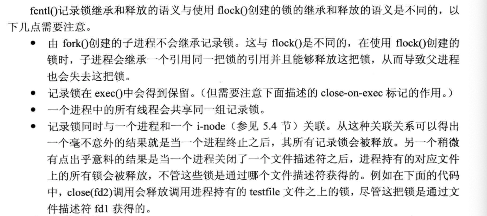

# LevelDB Read/Write and compaction


大致路径：

1. LevelDB 使用
2. read path
   1. Scan path
   2. point get path
3. write path
   1. compaction
   2. reading
4. 杂项
   1. open/close

一些要懂的结构：SSTable, Table, BlockCache

一些要懂的内容：Compaction

### Common operations

见 [index.md](https://github.com/mapleFU/mwish-leveldb-notes/blob/master/doc/index.md):

```c++
Status DB::Open(const Options& options, const std::string& dbname, DB** dbptr)
```

调用 `DB::Open` 打开一个数据库。`Options` 可以设置打开时的参数、运行时的 block cache 等参数。

LevelDB 的操作状态被包装在一个 `leveldb::Status` 里面（这个做法很 Google）。Slice 的逻辑比较简单，可以简单介绍一下：它分为 `ok` 状态和一些不合法的状态，比如 `corruption`, `IOError`. 它只可能是这些状态中的一个。此外它可能带有一个描述自身状态的 `const char*`, 这个生命周期是由它管理的。

关闭数据库只需要 `delete db;` 就行了（其实我觉得创建的时候传进去一个 `DB** dbptr` 还是蛮诡异的）

LevelDB 的读写有基本的 `Read` `Put` `Update` 接口，而读写提供了不同的 `Options`:

```c++
std::string value;
leveldb::Status s = db->Get(leveldb::ReadOptions(), key1, &value);
if (s.ok()) s = db->Put(leveldb::WriteOptions(), key2, value);
if (s.ok()) s = db->Delete(leveldb::WriteOptions(), key1);
```

`ReadOptions` 和 `WriteOptions` 说实话都比较简单：

```c++
// Options that control read operations
struct LEVELDB_EXPORT ReadOptions {
  ReadOptions() = default;

  // If true, all data read from underlying storage will be
  // verified against corresponding checksums.
  bool verify_checksums = false;

  // Should the data read for this iteration be cached in memory?
  // Callers may wish to set this field to false for bulk scans.
  bool fill_cache = true;

  // If "snapshot" is non-null, read as of the supplied snapshot
  // (which must belong to the DB that is being read and which must
  // not have been released).  If "snapshot" is null, use an implicit
  // snapshot of the state at the beginning of this read operation.
  const Snapshot* snapshot = nullptr;
};

// Options that control write operations
struct LEVELDB_EXPORT WriteOptions {
  WriteOptions() = default;

  // If true, the write will be flushed from the operating system
  // buffer cache (by calling WritableFile::Sync()) before the write
  // is considered complete.  If this flag is true, writes will be
  // slower.
  //
  // If this flag is false, and the machine crashes, some recent
  // writes may be lost.  Note that if it is just the process that
  // crashes (i.e., the machine does not reboot), no writes will be
  // lost even if sync==false.
  //
  // In other words, a DB write with sync==false has similar
  // crash semantics as the "write()" system call.  A DB write
  // with sync==true has similar crash semantics to a "write()"
  // system call followed by "fsync()".
  bool sync = false;
};
```

这几个意义也很明确（当然，以后看代码还会碰到）

在一个 WriteBatch 里面的写，可以被视作原子写（但是 leveldb 不提供事务语义，只有 RocksDB 提供）：

\(而且众所周知，leveldb 一个正常的请求也会走一次选举，生成一个 WriteBatch )

```c++
leveldb::Status s = db->Get(leveldb::ReadOptions(), key1, &value);
if (s.ok()) {
  leveldb::WriteBatch batch;
  batch.Delete(key1);
  batch.Put(key2, value);
  s = db->Write(leveldb::WriteOptions(), &batch);
}
```

leveldb 可以拿到 iterator 读，也可以拿到 snapshot 去读，注意这里还是有生命周期：

```c++
leveldb::Iterator* it = db->NewIterator(leveldb::ReadOptions());
for (it->SeekToFirst(); it->Valid(); it->Next()) {
  cout << it->key().ToString() << ": "  << it->value().ToString() << endl;
}
assert(it->status().ok());  // Check for any errors found during the scan
delete it;
```

和 snapshot

```c++
leveldb::ReadOptions options;
options.snapshot = db->GetSnapshot();
... apply some updates to db ...
leveldb::Iterator* iter = db->NewIterator(options);
... read using iter to view the state when the snapshot was created ...
delete iter;
db->ReleaseSnapshot(options.snapshot);
```


LevelDB 内部大量使用 `slice` 类型，表示“没有所有权的字符串”。这个有点类似 `std::string_view`, 不过功能弱不少。

此外，用户可以自己定制 comparator, 需要继承 `leveldb::Comparator` 这一接口类型。这个 comparator 也可以作为 `Options` 丢到 db 内容里. 然后这里提到了 comparator 的兼容性：

```
The result of the comparator's Name method is attached to the database when it is created, and is checked on every subsequent database open. If the name changes, the leveldb::DB::Open call will fail. Therefore, change the name if and only if the new key format and comparison function are incompatible with existing databases, and it is ok to discard the contents of all existing databases.

You can however still gradually evolve your key format over time with a little bit of pre-planning. For example, you could store a version number at the end of each key (one byte should suffice for most uses). When you wish to switch to a new key format (e.g., adding an optional third part to the keys processed by TwoPartComparator), (a) keep the same comparator name (b) increment the version number for new keys (c) change the comparator function so it uses the version numbers found in the keys to decide how to interpret them.
```

#### config about performance

leveldb 除了有 open 时候对应行为的配置，也有性能相关的配置

1. block size: block 是 leveldb 缓存组织的形式。默认的 block size 为 compaction 之前的 4096 bytes. 系统建议，如果 point get 占主要 workload, 可以把这个设小一点，否则可以设大一点。（TODO: 这个会影响写入的时候的 block 吗？）
2. Compression: 通俗的说，compaction 是读写的时候的 CPU 换压缩空间。`snappy` 是 Google 发明的压缩算法。这里可以把这个算法换成 `no compression`, 来加快写，减小 CPU.
3. Block cache: `options.block_cache` 设置读文件的时候用的 block cache, 当执行一些不希望用到 block cache 的操作的时候，可以使用 `options.fill_cache = false` 的配置。
4. 使用 `filter_policy`, 这个会在写入的时候，在 compaction 阶段略微会占用一点开销，但是能大大节省 point get 的开销。

>  Suppose all Bloom filters have *M* bits in total and have the same false positive rate across all levels, with N total keys, each bloom filter will has a false positive rate $O(e^{-\frac{M}{N}})$

这相当于 Get 开销乘以一个上面的值。当然对 range 来说优化不大。

#### checksums

`ReadOptions::verify_checksums` 表示读是否要验证 checksum, `Options::paranoid_checks` 在设置之后，可以检查打开的数据库的错误。

`leveldb::RepairDB` 会尽可能修复数据。

#### summary: `Options`

```c++

// Options to control the behavior of a database (passed to DB::Open)
struct LEVELDB_EXPORT Options {
  // Create an Options object with default values for all fields.
  Options();

  // -------------------
  // Parameters that affect behavior

  // Comparator used to define the order of keys in the table.
  // Default: a comparator that uses lexicographic byte-wise ordering
  //
  // REQUIRES: The client must ensure that the comparator supplied
  // here has the same name and orders keys *exactly* the same as the
  // comparator provided to previous open calls on the same DB.
  const Comparator* comparator;

  // If true, the database will be created if it is missing.
  bool create_if_missing = false;

  // If true, an error is raised if the database already exists.
  bool error_if_exists = false;

  // If true, the implementation will do aggressive checking of the
  // data it is processing and will stop early if it detects any
  // errors.  This may have unforeseen ramifications: for example, a
  // corruption of one DB entry may cause a large number of entries to
  // become unreadable or for the entire DB to become unopenable.
  bool paranoid_checks = false;

  // Use the specified object to interact with the environment,
  // e.g. to read/write files, schedule background work, etc.
  // Default: Env::Default()
  Env* env;

  // Any internal progress/error information generated by the db will
  // be written to info_log if it is non-null, or to a file stored
  // in the same directory as the DB contents if info_log is null.
  Logger* info_log = nullptr;

  // -------------------
  // Parameters that affect performance

  // Amount of data to build up in memory (backed by an unsorted log
  // on disk) before converting to a sorted on-disk file.
  //
  // Larger values increase performance, especially during bulk loads.
  // Up to two write buffers may be held in memory at the same time,
  // so you may wish to adjust this parameter to control memory usage.
  // Also, a larger write buffer will result in a longer recovery time
  // the next time the database is opened.
  size_t write_buffer_size = 4 * 1024 * 1024;

  // TODO(mwish): 这个地方如果超过限制了会怎么样？会限制读还是会限制写？
  //
  // Number of open files that can be used by the DB.  You may need to
  // increase this if your database has a large working set (budget
  // one open file per 2MB of working set).
  int max_open_files = 1000;

  // Control over blocks (user data is stored in a set of blocks, and
  // a block is the unit of reading from disk).

  // DB 使用的是 block_cache, 它以 size(容量) 为粒度
  // If non-null, use the specified cache for blocks.
  // If null, leveldb will automatically create and use an 8MB internal cache.
  Cache* block_cache = nullptr;

  // Approximate size of user data packed per block.  Note that the
  // block size specified here corresponds to uncompressed data.  The
  // actual size of the unit read from disk may be smaller if
  // compression is enabled.  This parameter can be changed dynamically.
  size_t block_size = 4 * 1024;

  // Number of keys between restart points for delta encoding of keys.
  // This parameter can be changed dynamically.  Most clients should
  // leave this parameter alone.
  int block_restart_interval = 16;

  // Leveldb will write up to this amount of bytes to a file before
  // switching to a new one.
  // Most clients should leave this parameter alone.  However if your
  // filesystem is more efficient with larger files, you could
  // consider increasing the value.  The downside will be longer
  // compactions and hence longer latency/performance hiccups.
  // Another reason to increase this parameter might be when you are
  // initially populating a large database.
  size_t max_file_size = 2 * 1024 * 1024;

  // Compress blocks using the specified compression algorithm.  This
  // parameter can be changed dynamically.
  //
  // Default: kSnappyCompression, which gives lightweight but fast
  // compression.
  //
  // Typical speeds of kSnappyCompression on an Intel(R) Core(TM)2 2.4GHz:
  //    ~200-500MB/s compression
  //    ~400-800MB/s decompression
  // Note that these speeds are significantly faster than most
  // persistent storage speeds, and therefore it is typically never
  // worth switching to kNoCompression.  Even if the input data is
  // incompressible, the kSnappyCompression implementation will
  // efficiently detect that and will switch to uncompressed mode.
  CompressionType compression = kSnappyCompression;

  // EXPERIMENTAL: If true, append to existing MANIFEST and log files
  // when a database is opened.  This can significantly speed up open.
  //
  // Default: currently false, but may become true later.
  bool reuse_logs = false;

  // If non-null, use the specified filter policy to reduce disk reads.
  // Many applications will benefit from passing the result of
  // NewBloomFilterPolicy() here.
  const FilterPolicy* filter_policy = nullptr;
};
```

我们还有 `block_restart_interval` `reuse_logs`  `max_file_size` 这几个不太熟悉的东西。

`Env*` 默认是 `PosixEnv` 的单例, 见 `util/env_posix.cc`, 这里提供了操作系统的操作。logger 也有 `PosixLogger` ，提供专门的 log 语义。


## Block/Table Definitions


## Read Path


## Write Path


## Extra libs

### env

env 定义在文件的 `util/env.h` 和 `util/env_{平台}.cc` 下面, 定义了这个平台默认的行为。和文件相关的内容全部封装在这个接口里。

这里定义了：

1. 文件相关的操作：
   1. `SequentialFile`, 顺序 Read 和 Skip 的文件，提供的借口类似 OS 的接口。
   2. `RandomAccessFile` 随机读的文件，用 `pread` 或者 `mmap` 来实现。提供一个带 `offset` 和 `size` 的 read 接口；需要注意的是，这里使用了 Limit, 限制数量为 1000 的 `mmap` 的 `RandomAccessFile` （这个配置参数是可以修改的）。作者认为：
      1. mmap 本身可以在 random access 的情况下优化读（感觉这是因为 LevelDB 本身 Block Cache 使用的 LRU 策略比较简单）
      2. Mmap 本身限制在了 1000 个：https://github.com/mapleFU/mwish-leveldb-notes/commit/946e5b5a4ce7980917b22a408f090a4e86c3fa44 作者认为这样可以优化性能。
   3. `WriteAbleFile`, 提供了 `Append` `Close` `Flush` `Sync` 的语义。Flush 只把用户态的 buffer \( LevelDB 有个用户态 buffer `kWritableFileBufferSize = 65536` \) 丢给 `write`, `sync` 走 `fsync` 之类的语义，把文件内容同步过去。
   4. 对文件、目录相关的创建、删除操作；rename 文件的操作
   5. 获取文件大小
   6. 获取文件锁的操作
2. 时间相关的操作：
   1. 获取现有的时间
   2. 睡 MircoSec 的操作
3. `Schedule` 和 `StartThread`, 对任务的操作。
4. 获取一个平台相关的 `Logger` (或许我应该看看 Logger 库都要提供什么样的语义了)

值得一提的是，这里把对 manifest 的处理做到了 file 层面上（其实我个人不太喜欢这样抽象）：

```c++
  // sync 相当于 flush + syncFd(
  Status Sync() override {
    // Ensure new files referred to by the manifest are in the filesystem.
    //
    // This needs to happen before the manifest file is flushed to disk, to
    // avoid crashing in a state where the manifest refers to files that are not
    // yet on disk.
    Status status = SyncDirIfManifest();
    if (!status.ok()) {
      return status;
    }

    status = FlushBuffer();
    if (!status.ok()) {
      return status;
    }

    return SyncFd(fd_, filename_);
  }
```

对文件加锁这里也是劝告锁，这里使用了 `fcntl` 调用。fcntl 允许更细粒度的控制，而且子进程不会和 `flock` 一样继承锁：

```c++
  Status LockFile(const std::string& filename, FileLock** lock) override {
    *lock = nullptr;

    int fd = ::open(filename.c_str(), O_RDWR | O_CREAT | kOpenBaseFlags, 0644);
    if (fd < 0) {
      return PosixError(filename, errno);
    }

    if (!locks_.Insert(filename)) {
      ::close(fd);
      return Status::IOError("lock " + filename, "already held by process");
    }

    if (LockOrUnlock(fd, true) == -1) {
      int lock_errno = errno;
      ::close(fd);
      locks_.Remove(filename);
      return PosixError("lock " + filename, lock_errno);
    }

    *lock = new PosixFileLock(fd, filename);
    return Status::OK();
  }
  
int LockOrUnlock(int fd, bool lock) {
  errno = 0;
  struct ::flock file_lock_info;
  std::memset(&file_lock_info, 0, sizeof(file_lock_info));
  file_lock_info.l_type = (lock ? F_WRLCK : F_UNLCK);
  file_lock_info.l_whence = SEEK_SET;
  file_lock_info.l_start = 0;
  file_lock_info.l_len = 0;  // Lock/unlock entire file.
  return ::fcntl(fd, F_SETLK, &file_lock_info);
}
```

需要注意的是，`flock` 锁与进程关联，而 `fcntl` 和文件描述符表关联。



它获取时间的调用比较正常，就是简单拿到现有 `us`. 这个很可能会走 vDSO, 或者走 syscall。同时获取时间可能本身会有 50ns 左右的开销（详见 PingCAP 的 zhongzc 的 talk）。

https://stackoverflow.com/questions/12392278/measure-time-in-linux-time-vs-clock-vs-getrusage-vs-clock-gettime-vs-gettimeof

#### 线程相关

```c++
void PosixEnv::Schedule(
    void (*background_work_function)(void* background_work_arg),
    void* background_work_arg) {
  background_work_mutex_.Lock();

  // Start the background thread, if we haven't done so already.
  if (!started_background_thread_) {
    started_background_thread_ = true;
    std::thread background_thread(PosixEnv::BackgroundThreadEntryPoint, this);
    background_thread.detach();
  }

  // If the queue is empty, the background thread may be waiting for work.
  if (background_work_queue_.empty()) {
    background_work_cv_.Signal();
  }

  background_work_queue_.emplace(background_work_function, background_work_arg);
  background_work_mutex_.Unlock();
}

void PosixEnv::BackgroundThreadMain() {
  while (true) {
    background_work_mutex_.Lock();

    // Wait until there is work to be done.
    while (background_work_queue_.empty()) {
      background_work_cv_.Wait();
    }

    assert(!background_work_queue_.empty());
    auto background_work_function = background_work_queue_.front().function;
    void* background_work_arg = background_work_queue_.front().arg;
    background_work_queue_.pop();

    background_work_mutex_.Unlock();
    background_work_function(background_work_arg);
  }
}
```

（话说这两个玩意竟然共享同一把锁...）

其实我感觉这里让我有点迷惑的是，它 `Signal` 之后再 `Unlock`，感觉很奇怪= =

#### 其他 `env`

`helpers/memenv` 提供了把 memory 当成 env 的环境，搜了一下代码，发现是给 testutil 用的

### util/arena

https://zhuanlan.zhihu.com/p/143445793

回头注意一下接口：

1. Allocate: 直接申请对应的内存
2. `AllocateAligned`: 申请对齐 pointer size 的内存

arena 本身提供给 SkipList 使用。`MemTable::Add` 调用了 `Allocate`, SkipList 的 NewNode 调用了 `AllocateAligned` 来创建 `Node`, 因为指针操作的特性，所以需要这个。`MemTable::Add` 使用这个来把 key 和一些别的 info 创建到 key 里面。

这个 `aligned` 和系统相关的 align alloc 还是有点差异的，

### util/bloom

我还照着 leveldb 写了一个：https://github.com/mapleFU/md-snippets/tree/master/components/bloom_filter

首先，FilterPolicy 是可以丢到 `Options` 里面的，所以这个地方可以自己定制一些对 key 的规则。

其次，这里：

1. 同时 bloom 需要的多个 hash 是根据 `util/hash` 一个 hash 来 `rotate` 生成的
2. bloom 需要的 key 数目是 fixed 的，因为写下去就知道有多少了。